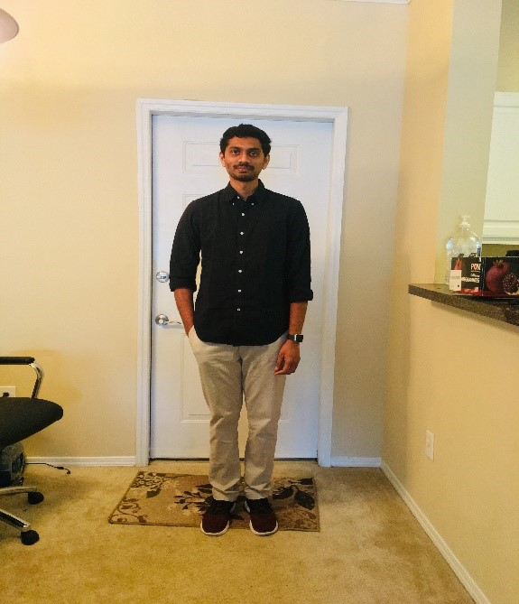

# 2019SpringInClass
This is our in class project

### About Myself

Hello, This is Krishna Teja Swarna (N03854630) pursuing masters in computer science major at SUNY New Paltz as an international student. Since my childhood I was very much fascinated by the potential of the computer, the practical exposure I received on concepts like Statistics, Algorithms and the use of probability in development prompted me to take up computer science as my major in undergrad. During the course of my study, I developed unique interest in the areas of Programming Languages like C, C++, and Java, web development tools like HTML, CSS and Java Script and Database Management Systems like SQL. Due to my growing interest on software concepts and programming skills, I choose the area of Information Security in my final year of under graduation project work. I worked on a project titled “Secure Password Sharing Using Secret Sharing Technique”. It is an application to share password securely between the number of owners in an organization using Secret Sharing technique. A Secret sharing technique starts with a secret and then derives from it certain shares, which are distributed to the users. The users can gain access to the resources only when they enter all their shares correctly. This method often overcomes the possibility of passwords getting hacked easily.

As a fresher I found much attracted to web development after looking at the graphical user interfaces of the websites like Apple, Amazon, and Facebook etc. So, I started learning basics of HTML5 and CSS from W3Schools but, I thought that I was lacking practical experience and now I am so thankful that I have Web Server Programming course in this semester. I would like to develop a website with great GUI using the expertise that I would get by the end of the semester.
